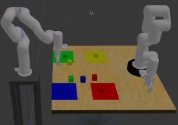

# Gazebo ROS Dual Arm Sorting

A ROS-based simulation project for controlling two robotic arms in Gazebo to perform an automated sorting task. The system detects cube colors, plans grasping motions, and places each cube in its designated location.

## 📌 Overview

This project simulates a **dual robotic arm sorting station** using **ROS** and **Gazebo**, integrating motion planning, perception, and manipulation:

1. One arm simulates a user, placing four differently colored cubes each in a unique zone without repetition.
2. The second arm checks whether the cubes are correctly placed.
3. It repositions incorrectly placed cubes.
4. It organizes remaining cubes by color.

Color detection uses **OpenCV**, and the available camera model is **RealSense D435**.

## ✨ Features

* Dual-arm robot simulation in Gazebo
* Color-based detection with OpenCV
* RealSense D435 camera model
* Grasping and placing with MoveIt
* Predefined sorting positions per color
* ROS-integrated launch files for quick setup

## 📦 Requirements

* ROS Noetic
* Gazebo 11
* MoveIt
* Ubuntu 20.04 LTS

## ⚙️ Installation

```bash
cd ~/catkin_ws/src
git clone https://github.com/jupazamo/gazebo-ros-dual-arm-sorting.git
cd ~/catkin_ws
catkin_make
source devel/setup.bash
```

## 🚀 Usage

Run in separate terminals:

```bash
roslaunch xarm_gazebo xarm_camera_scene.launch
rosrun xarm_gazebo script_launcher.py
```

### 🖥 Key Scripts

#### **script\_launcher.py**

This script sequentially launches the main simulation control nodes:

1. **xarm2\_random\_placer.py** – Simulates a user-controlled arm randomly placing cubes.
2. **zone\_checker.py** – Verifies if the cubes are correctly positioned in their respective zones.
3. **color\_recognition.py** – Detects cube colors using OpenCV for sorting.

It sets the correct ROS namespace for each process and ensures each step completes before moving to the next.

## 📂 Repository Structure

```
xarm_ros/
 ├── LICENSE
 ├── README.md
 ├── uf_robot_moveit_config/
 ├── xarm6_moveit_config/
 ├── xarm_bringup/
 ├── xarm_description/
 ├── xarm_gripper/
 ├── xarm_msgs/
 ├── xarm_sdk/
 ├── xarm6_gripper_moveit_config/
 ├── xarm_api/
 ├── xarm_controller/
 ├── xarm_gazebo/
 │   ├── CMakeLists.txt
 │   ├── package.xml
 │   ├── launch/
 │   │   └── xarm_camera_scene.launch
 │   ├── scripts/
 │   │   ├── color_recognition.py
 │   │   ├── hsv_inspector.py
 │   │   ├── script_launcher.py
 │   │   ├── xarm2_random_placer.py
 │   │   └── zone_checker.py
 │   └── worlds/
 │       └── xarm_camera_scene.world
 ├── xarm_moveit_servo/
 └── xarm_planner/
```

## 🧠 Key scripts explained

### `script_launcher.py`

A lightweight orchestrator that runs the three main nodes in sequence using the correct ROS namespaces.

**What it does**

* Sets environment variable `ROS_NAMESPACE` before each subprocess to scope topics/services.
* Launches:

  1. `xarm2_random_placer.py` under namespace `xarm2` (simulated user arm that randomly places 4 cubes, no repeated colors).
  2. `zone_checker.py` under namespace `xarm` (validation arm that detects misplacements and fixes them).
  3. `color_recognition.py` under namespace `xarm` (same arm that then sorts remaining center blocks by color).
* Waits for each node to exit (`Popen.wait()`), then starts the next one. This guarantees a clean, staged workflow.

**Why namespaces?**
Two arms are spawned in the scene. Namespacing (`xarm` / `xarm2`) prevents topic collisions between controllers, MoveIt groups, and camera subscribers/publishers.

**How to run**

1. In Terminal A: `roslaunch xarm_gazebo xarm_camera_scene.launch`
2. In Terminal B: `rosrun xarm_gazebo script_launcher.py`

**Command-line overrides**
The script passes `'_robot_type:=xarm'` style private parameters. If you extend to other robot types, adapt:

```python
ROBOT_TYPE = "xarm"
ROBOT_TYPE2 = "xarm"
# ...
subprocess.Popen(['rosrun','xarm_gazebo','xarm2_random_placer.py', f'_robot_type:={ROBOT_TYPE2}'], env=env)
```

**Typical console output**

```
[SCRIPT LAUNCHER] Iniciando xarm2_random_placer.py...
... (placement logs) ...
[SCRIPT LAUNCHER] Finalizado zone_checker.py.
[SCRIPT LAUNCHER] Iniciando zone_checker.py...
... (correction logs) ...
[SCRIPT LAUNCHER] Finalizado zone_checker.py.
[SCRIPT LAUNCHER] Iniciando color_recognition.py...
... (final sorting logs) ...
[SCRIPT LAUNCHER] Finalizado color_recognition.py.
```
---

### `xarm2_random_placer.py`

This node makes **xArm #2** scan the table, detect four colored cubes, and place each one into a randomly assigned (non‑repeating) target zone. It couples **OpenCV** color segmentation with **MoveIt** motion execution.

**What it does (high level)**

1. **Phase 1 – Scan:** subscribes to the RGB camera (`sensor_msgs/CompressedImage`), segments red/blue/green/yellow regions, and detects one rectangle per color.
2. **Phase 2 – Execute:** randomly permutes four destination zones and, for each detected color:

   * converts pixel center → table millimeters
   * transforms table → robot base
   * executes a pick at a safe approach, grasps, lifts, and places at the assigned zone
   * overlays a **single highlighted bounding box** on the live camera for the cube currently being moved.

**Parameters (ROS)**

| Name            | Type      |                       Default | Meaning                                                                    |
| --------------- | --------- | ----------------------------: | -------------------------------------------------------------------------- |
| `~namespace`    | string    |                            "" | Prefix for MoveIt groups (if you run multi-robot with separate namespaces) |
| `~dof`          | int       |                           `6` | xArm DoF (6 or 7)                                                          |
| `~camera_topic` | string    | `camera/image_raw/compressed` | Compressed RGB topic to subscribe                                          |
| `~base_tf`      | float\[3] |                     `[0,0,0]` | Rigid transform **table→robot base**: dx \[mm], dy \[mm], dθ \[deg]        |
| `~safe_z`       | float     |                          `50` | Safe Z (mm) for approach/retreat                                           |
| `~grab_z`       | float     |                       `-67.5` | Pick Z (mm), relative to robot base frame used by MoveIt                   |
| `~robot_type2`  | string    |                        `xarm` | Prefix for MoveIt group names (`xarm6`, `xarm_gripper`)                    |

**Internal constants you can tune in code:**

* `COLOR_DICT` (HSV thresholds)
* `TARGET_ZONES` (mm coordinates of the four mats)
* `ZONE_RANDOM_OFFSET` (random jitter inside a zone)
* `MAX_BLOCK_AREA_PX` (filters out large contours such as mats)

**Topics & I/O**

* **Subscribe:** `~camera_topic` (`sensor_msgs/CompressedImage`)
* **MoveIt groups:** `xarm6` (or namespaced) and `xarm_gripper`
* **No custom publishers** (visual feedback is via OpenCV window and optional MP4 recording)

**Key components in the script**

**1) Vision**

* `get_recognition_rects(frame, lower, upper)`

  * Gaussian blur → HSV → erosion → inRange → contours → `minAreaRect`
  * filters tiny contours and too‑large areas, returns a list of rectangles and a visualization frame
* **Highlighting in UI**

  * `draw_minarearect` draws a labeled box **only** for the cube currently being moved
  * Live display handled by `Display.show()` with optional recording

**2) Pixel → millimeters → robot base**

* `rect_to_xy_mm(rect)` converts the **pixel center** of the rectangle to **table mm** using a calibrated affine mapping
* `mesa_to_robot(x_mm, y_mm, dx, dy, dθ)` rotates and translates table coordinates to the robot base using `~base_tf`

**3) Motion execution**

* `XArmCtrl.moveto(x, y, z)` sets a pose goal (keeping current orientation), MoveIt plans and executes
* `GripperCtrl.open()/close()` actuates the named targets `open` / `close`
* `MotionThread` consumes tasks from a queue: pick at source (approach→grasp→lift), place at destination (approach→open)

**4) Flow (main loop)**

1. **Detection phase** until all 4 colors are located.
2. Randomly assign the four `TARGET_ZONES`.
3. For each color:

   * compute source mm, transform to robot
   * show a single labeled bounding box for context
   * enqueue a pick‑and‑place task, then visually **track the same color** during motion by selecting the nearest current rect to the original center
4. After all moves, send the arm to `home` and exit.


**Coordinate notes & calibration**

* The `rect_to_xy_mm` mapping constants (466, 552, 900/460, offsets) were calibrated for this scene; if you change camera intrinsics, table pose, or image size, recalibrate these values.
* Use `~base_tf` when your **table origin** is not perfectly aligned with the robot base frame.

**Example output**

```
[INFO] FASE 1: Escaneando la mesa...
  ✓ Bloque 'red' localizado.
  ✓ Bloque 'blue' localizado.
  ✓ Bloque 'green' localizado.
  ✓ Bloque 'yellow' localizado.
FASE 2: Generando y ejecutando el plan...
Recogiendo de (Mesa: 620.4, -210.7)
Soltando en (Mesa: 635.0, -245.0)
...
✓ Tarea completada: 4 bloques redistribuidos aleatoriamente.
```

---
### `zone_checker.py`

A ROS node that **verifies cube placement by color**, highlights any misplacements in the camera view, and **commands the arm** to relocate erroneous cubes to their correct mats. When the workspace is clean (all cubes correctly placed), it **publishes** `/zones_clear=True` and shuts down.

**What this node does**

* Subscribes to a **compressed camera stream** and detects color blobs (OpenCV HSV).
* Converts pixel detections to **table-frame millimeters** with a calibrated mapping.
* Checks if each detected cube is inside its **target color zone**.
* If a cube is **misplaced**, it enqueues a pick-and-place correction for the manipulator.
* Draws an annotated camera overlay:

  * **Green** boxes = correct placements
  * **Gray** boxes = cubes in the center (off mats)
  * **Red** boxes = misplaced cubes (also labeled `color @ zone`)
  * **Yellow** box = the cube currently being corrected (tracked during motion)
* Publishes `/zones_clear=True` when no errors remain and the arm is idle.

**Where it fits in the workflow**

1. User (or the first arm) places cubes in random mats.
2. **`zone_checker.py`** analyzes live detections and corrects any misplacements.
3. Once clear, it signals completion with `/zones_clear=True` so downstream nodes can continue.

**ROS Interfaces**

**Parameters**

* `~robot_type` (str, default: `xarm`) — Selects the MoveIt groups: `<robot_type>_gripper` and `<robot_type><dof>`.
* `/xarm/DOF` (int, default: 6) — Degrees of freedom for the arm MoveGroup.

**Publishers**

* `/zones_clear` (`std_msgs/Bool`, latched) — `True` when all cubes are correctly placed and the arm is idle.

**Subscribers**

* Camera: `camera/image_raw/compressed` (`sensor_msgs/CompressedImage`) — RGB feed for color segmentation.

**Coordinate frames and zones**

* **Pixel → mm**: `rect_to_xy_mm(rect)` maps the rectangle center in pixels to **table coordinates (mm)** using a linear calibration tuned for the Gazebo scene.
* **Target zones** (mm):

  * Red → `(660, -250)`
  * Blue → `(340, -250)`
  * Green → `(340, 250)`
  * Yellow → `(660, 250)`
* **Zone size**: squares of half-width `ZONE_HALF = 60` mm. A point is *in zone* when both `|x−x0| ≤ 60` and `|y−y0| ≤ 60`.

**High-level algorithm**

1. **Acquire frame** from the camera queue.
2. For each color in `COLOR_DICT`:

   * Threshold in HSV, find contours, compute `minAreaRect`.
   * Convert each rect center to `(x_mm, y_mm)`.
   * Determine `zone_of_point(x_mm, y_mm)`.
   * Classify and draw:

     * In correct zone → **green** overlay.
     * Off all mats (center heap) → **gray** overlay.
     * On a wrong mat → **red** overlay, enqueue candidate correction.
3. If there is at least one misplacement and the arm is **idle**, push a correction task into the motion queue.
4. While the motion runs, **track** the selected cube (nearest rect to its last known pixel center) and draw it **yellow**.
5. When there are **no misplacements** and the arm is **idle**, publish `/zones_clear=True` and exit.

**Key components**

**1) Color segmentation**

* `COLOR_DICT` defines HSV ranges for `red`, `blue`, `green`, `yellow`.
* `get_rects(frame, lower, upper)` performs blur → HSV → erode → `inRange` → `findContours` → `minAreaRect`.

**2) Placement logic**

* `zone_of_point(x_mm, y_mm)` returns which color mat contains the point, or `None` if off-mat.
* `point_in_zone(x_mm, y_mm, color)` checks whether a point belongs to its *own* color zone.

**3) Motion control thread**

* `MotionThread` owns the **MoveIt** arm (`ArmCtrl`) and gripper (`GripperCtrl`).
* Safe sequencing:

  * Open gripper → **lift to safe Z** → move in XY → descend → close → lift → move to target zone → open.
* Consumes tasks from a `Queue` with payload `{'rects': [...], 'color': <str>}`.

**4) Display overlay**

* `Display` manages a resizable OpenCV window and optional video recording.
* Color conventions are centralized in `COLOR_BGR`.
* Windows are disabled automatically if `DISPLAY` is absent (headless run).

**Configuration knobs you can tune**

* **HSV ranges** in `COLOR_DICT` for your lighting and colors.
* **Zone centers** in `COLOR_TARGET_ZONE` and **half-size** via `ZONE_HALF`.
* **Safe and grasp heights** in `MotionThread` constructor (`safe_z`, `grab_z`).
* **Window size** via `Display(size=(w,h))` and the immediate resize calls:

  ```python
  cv2.namedWindow("Zone Checker Camera", cv2.WINDOW_NORMAL)
  cv2.resizeWindow("Zone Checker Camera", 640, 480)
  ```
* **De-dup threshold** for previously processed cubes: `hypot(...) < 15`.

**Typical run sequence (pseudolog)**

```
[INFO] Zone check (phase 0) – OK:2 WRONG:1 CENTER:3
[INFO] Dispatching correction → Fix: red
[INFO] Correcting misplacement (tracking red)
[INFO] ✓ Todos los tapetes tienen bloques correctos.
[INFO] ✓ Tarea completada... publicando /zones_clear=True
```

---
### `color_recognition.py`

A ROS node that finishes the workflow by **sorting the remaining cubes** (those left at the table center) **by color**, one color at a time. It subscribes to a compressed RGB camera stream, detects colored blocks via OpenCV (HSV masking + contour geometry), and commands the xArm manipulator (MoveIt) to pick each block and place it on its designated mat.

**What this node does**

1. **Subscribe to camera**: `/camera/image_raw/compressed` → convert to OpenCV image with `CvBridge`.
2. **Detect blocks by color**: For each color (red, blue, green, yellow), compute an HSV mask, find contours, and filter small noise.
3. **Avoid re-processing**: Keep per-color memory (`classified_centers`) and ignore blocks already handled or those already at their destination (near drop/mat).
4. **Plan + execute**: When a new block for the current color is found, send a pick-and-place task to a motion thread (MoveIt group for arm + gripper).
5. **Visual feedback**: Overlay a minAreaRect and status text. While the arm is moving, track only the active block.
6. **Stop condition**: If no more blocks are found and the arm is idle, the node exits gracefully.

**ROS interfaces**

* **Subscriber**: `sensor_msgs/CompressedImage` on `camera/image_raw/compressed` (class `GazeboCamera`).
* **No publishers**: The node logs to ROS console and shows OpenCV windows for visualization.
* **Parameters used**:

  * `~robot_type` (default: `xarm`) → MoveIt group names.
  * `/xarm/DOF` (default: `6`) → select MoveIt planning group (e.g., `xarm6`).

**Vision pipeline (OpenCV)**

* **Gaussian blur** → `cv2.cvtColor(..., BGR2HSV)` → **erosion** to denoise → `cv2.inRange()` for color mask.
* **Contours**: `cv2.findContours()` on the mask, then **minAreaRect** to get center and orientation.
* **Filtering**:

  * Discard very small rectangles (`rect[1][0] < 8 or rect[1][1] < 8`).
  * Discard blocks already at destination (close to `COLOR_TARGET_ZONE[color]`).
  * Discard blocks already processed for that color (`classified_centers`).
* **Helpers**:

  * `draw_minarearect(...)` to render detections.
  * `rect_to_xy_mm(...)` converts pixel centers → table-frame millimeters using the calibrated linear map.
  * `nearest_rect(...)` to keep tracking the currently moving block.

**Color ranges (HSV)** — stored in `COLOR_DICT`:

* `red`, `blue`, `green`, `yellow` with `{lower, upper}` thresholds.

> Tune these with the `hsv_inspector.py` helper if needed.

**Motion pipeline (MoveIt)**

* **Arm controller**: `XArmCtrl` (MoveGroupCommander for `xarm<dof>`), simple `moveto(x,y,z)` API.
* **Gripper**: `GripperCtrl` with named targets `open` and `close`.
* **Execution thread**: `GazeboMotionThread` pops tasks from a `Queue`, then:

  1. Lift to safe Z
  2. Move above block → descend → **close** gripper
  3. Lift → move to the target mat (per color) → **open** gripper
* **Targets**: `COLOR_TARGET_ZONE` (mm in table frame).

**Important constants to tune**

* `COLOR_DICT` — HSV thresholds per color (dependent on lighting/rendering).
* `COLOR_TARGET_ZONE` — target positions (mm) for each color.
* `DROP_ZONE_PX` — approximate pixel locations for UI/heuristics.
* Size filter inside `get_recognition_rect(...)` — removes tiny noise (<8 px side in the minAreaRect).
* Window/UI sizing (class `Display`) — change `size=(960,540)` or call `cv2.resizeWindow(...)` as done in `__main__`.

**Execution flow (high level)**

```text
start node → init MoveIt and camera → while not shutdown:
  if arm is moving and a color is active:
    track only that block and draw UI
  else:
    for each color in randomized order:
      detect blocks of that color
      filter already-placed / previously-processed
      if new block found:
        draw UI, enqueue motion (pick & place), set active color/center
        break (handle one block per loop)
  if no tasks found and arm idle → log ✓ and shutdown
```

**Key code map**

* **Camera**: `GazeboCamera` (subscriber + queue) → `get_frame()`.
* **Vision**: `get_recognition_rect(...)`, `draw_minarearect(...)`, `rect_to_xy_mm(...)`.
* **Control**: `XArmCtrl`, `GripperCtrl`, `GazeboMotionThread` (worker thread).
* **UI**: `Display.show(...)` overlays status and resizes window; additional manual `cv2.resizeWindow("Sorter Camera", 640, 480)` in `__main__`.
* **State**: `classified_centers` to prevent double-handling; `current_color` & `current_center_px` for tracking during motion.

---

<h2>📸 Results</h2>

<p><b>Figure 1.</b> Fase 1 – Random selection of four cubes without repetition.<br>

</p>

<p><b>Figure 2.</b> Coordinate calculation for the selected cube.<br>

</p>

<p><b>Figure 3.</b> Execution of movement: red cube.<br>

</p>

<p><b>Figure 4.</b> Execution of movement: green cube.<br>

</p>

<p><b>Figure 5.</b> Execution of movement: yellow cube.<br>

</p>

<p><b>Figure 6.</b> Execution of movement: blue cube.<br>

</p>

<p><b>Figure 7.</b> Result of random redistribution in Gazebo.<br>

</p>

<p><b>Figure 8.</b> Verification process by the second robot.<br>

</p>

<p><b>Figure 9.</b> Correction of cube placement.<br>

</p>

<p><b>Figure 10.</b> Final arrangement of all cubes.<br>

</p>
